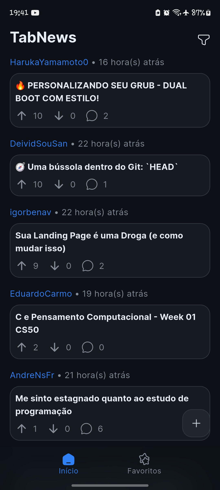
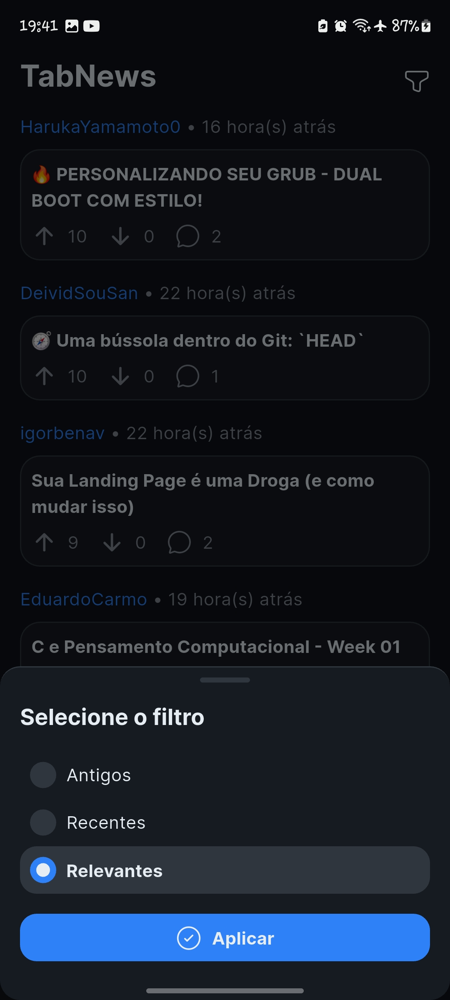
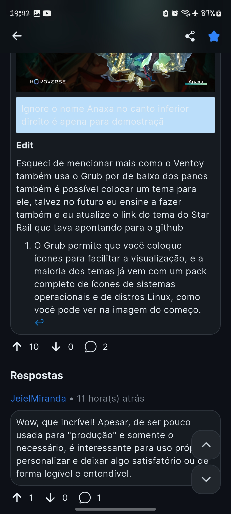
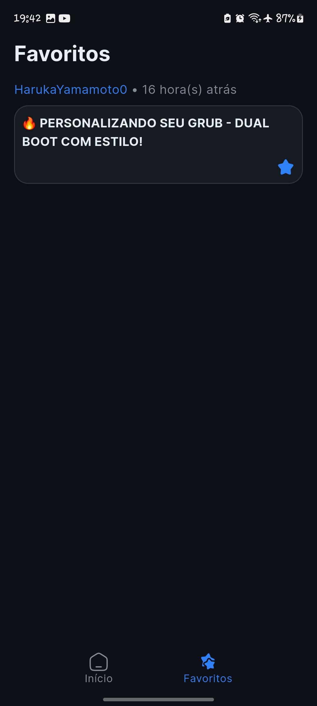

# TabNews Client

Cliente mobile construído em Flutter para visualizar e interagir com as
notícias/artigos publicados no [TabNews](https://tabnews.com.br).

## 🧑‍💻 Tecnologias

* Dart
* Flutter

Veja as dependências do projeto em: [pubspec.yaml](./pubspec.yaml)

## 🖥️ Plataformas

* IOS(12+) ✅
* Android(5.1+|SDK22+) ✅

## 🧰 Recursos

* Temas claro e escuro
* Visualização de posts
* Compartilhamento de posts
* Visualização de comentários
* Contagem de tabcoins e comentários
* Adição e remoção de posts favoritos
* Filtragem por posts antigos, recentes ou relevantes

## 🌐 TabNews API

Esta aplicação é baseada na versão 1 da api, disponível através da rota:
[https://tabnews.com.br/v1](https://tabnews.com.br/v1) e descrita na
documentação não oficial: [https://coffee-is-power.github.io/tabnews-openapi/](https://coffee-is-power.github.io/tabnews-openapi/).

## ⚠️ Aviso Importante

Este projeto não é afiliado, associado, autorizado, endossado por, ou de
qualquer forma oficialmente conectado ao TabNews ou a qualquer uma de
suas subsidiárias ou afiliadas. O site oficial do TabNews pode ser encontrado em
[https://tabnews.com.br](https://tabnews.com.br). "TabNews", bem como nomes,
marcas, emblemas e imagens relacionados, são marcas registradas de seus
respectivos proprietários.

## 📷 Imagens

<table>
  <tr>
    <td>
      
    </td>
    <td>
      
    </td>
    <td>
      
    </td>
  </tr>
  <tr>
    <td>
      
    </td>
    <td>
      
    </td>
  </tr>
</table>

## 📜 Credits

* SoftYes TI [\<softyes.com.br\>](https://softyes.com.br)
* João Sereia [\<joao.sereia@softyes.com.br\>](mailto:joao.sereia@softyes.com.br)
