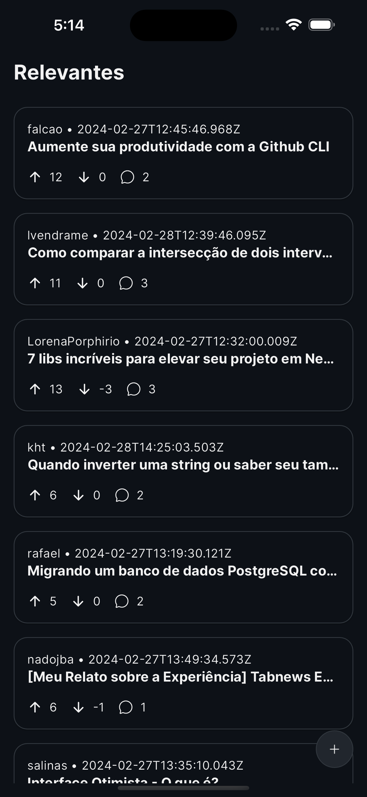
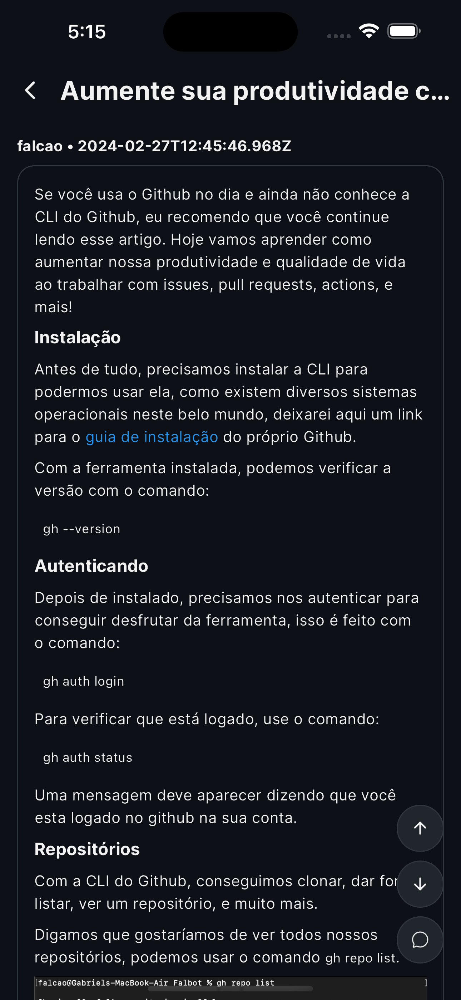
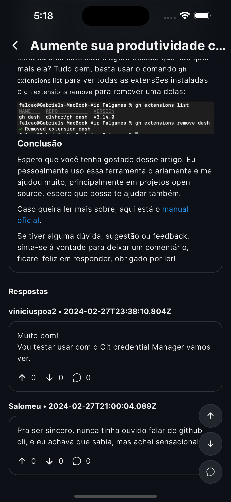
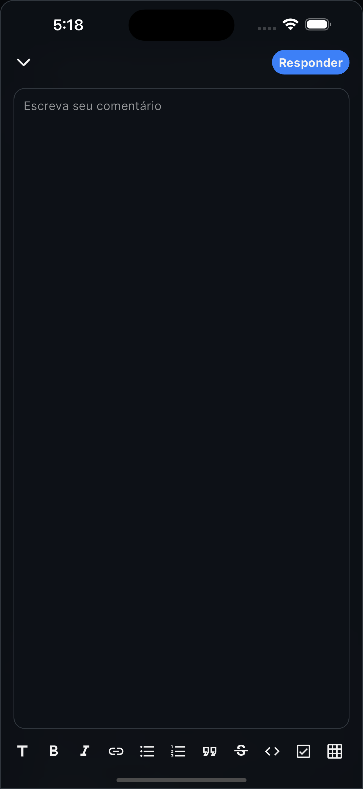

# TabNews Client

Cliente mobile construído em Flutter para visualizar e interagir com as notícias/artigos publicados no [TabNews](https://tabnews.com.br).

## Tecnologias

* Dart
* Flutter
* GetX
* Make

Veja as dependências do projeto em: [pubspec.yaml](https://github.com/softyesti/tabnews_client/blob/main/pubspec.yaml)

## Plataformas

* IOS 12+
* Android 5.0+

## Recursos

* Visualização de posts
* Compartilhamento de posts
* Visualização de comentários
* Adição e remoção posts favoritos
* Contagem de tabcoins e comentários
* Filtragem por antigos, recentes e relevantes

## TabNews API

Esta aplicação se baseia na versão v1 da api, disponível através da rota: [https://tabnews.com.br/v1](https://tabnews.com.br/v1) e descrita na documentação não oficial: [https://coffee-is-power.github.io/tabnews-openapi/](https://coffee-is-power.github.io/tabnews-openapi/)

## Imagens

<table>
  <tr>
    <td>
      
    </td>
    <td>
      
    </td>
    <td>
      
    </td>
  </tr>
  <tr>
    <td>
      
    </td>
  </tr>
</table>
